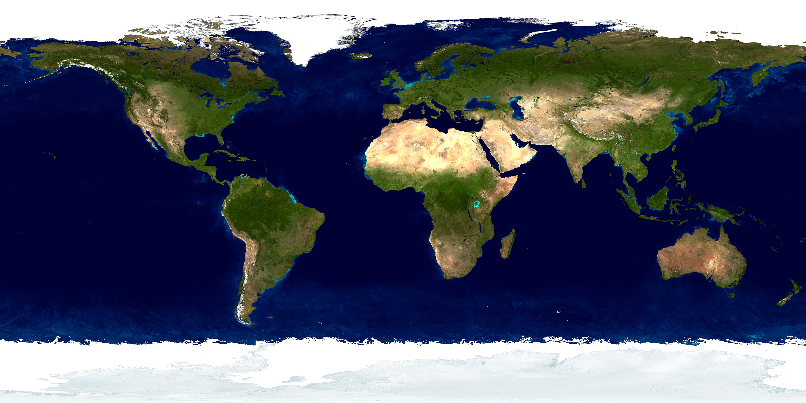
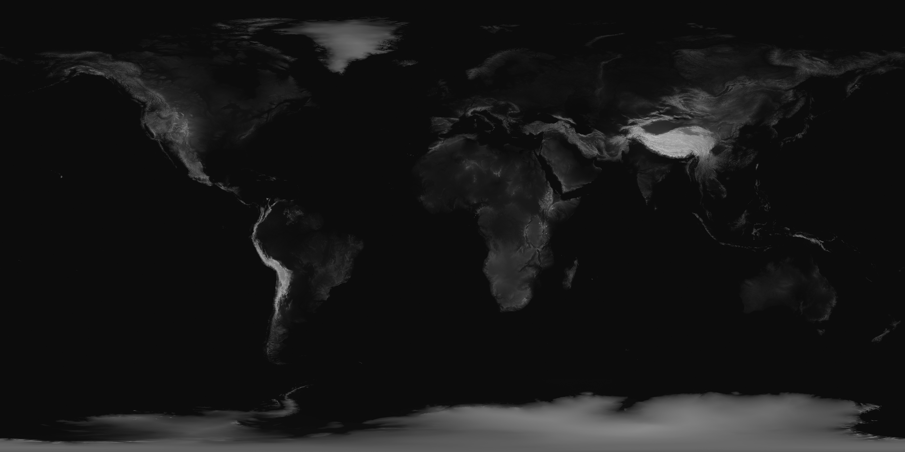
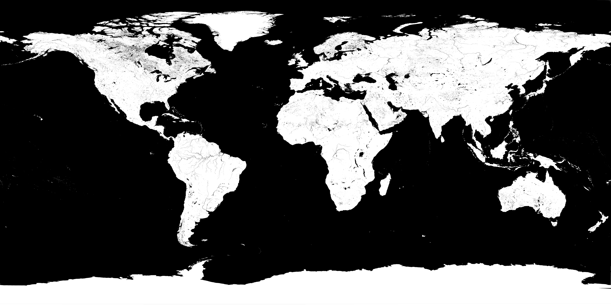

# spaceXwatch
WebGL app using MERN stack and Three.js. We take your lat and long and convert it to a cartesian coordinate(x, y, z) on a 3D rednered earth. 
For demo we are using an API from SpaceX to plot each place a rocket as taken off from. 

## Notable technolgies used:
<ul>
  <li>React</li>
  <li>Three.js</li>
  <li>Express</li>
  <li>Node.js</li>
  <li>MYSQL</li>
  <li>Passport</li>
  <li>GraphQL(currently in development)</li>
</ul>

## 3D WebGL rendered objects using Three.js:
<ul>
  <li>Earth</li>
  <li>Lighting</li>
  <li>Moon</li>
  <li>Stars</li>
  <li>Plot Points(lines and rings)</li>
</ul>

## How it works

### Camera and Aspect Ratio
To start we first need to set up the aspect ratio and camera settings
 
<code>

    // set width and height of browser
    const width = window.innerWidth - 17;
    const height = window.innerHeight;

    // init scene and camera
    const scene = new THREE.Scene()
    const camera = new THREE.PerspectiveCamera(
      75,
      width / height,
      0.1,
      1000
    )
    camera.lookAt(new THREE.Vector3(0, 0, 0));

    // init web gl renderer into variable
    const renderer = new THREE.WebGLRenderer();
    // set size of renderer accoring to variable set above
    renderer.setSize(width, height);

    // set camera position from viewscreen
    camera.position.z = 13;

</code>

### Skybox creation
This is the illusion of being in space. basically we create a massive sphere around everything with star texture wrapping the inside of it
 
  <code>

    //Space background is a large sphere
    var spacetex = THREE.ImageUtils.loadTexture("/spacex/images/newspace");
    var spacesphereGeo = new THREE.SphereGeometry(50,32,32);
    var spacesphereMat = new THREE.MeshBasicMaterial();
    spacesphereMat.map = spacetex;
    var spacesphere = new THREE.Mesh(spacesphereGeo,spacesphereMat);
    //spacesphere needs to be double sided as the camera is within the spacesphere
    spacesphere.material.side = THREE.DoubleSide;
    spacesphere.material.map.wrapS = THREE.RepeatWrapping; 
    spacesphere.material.map.wrapT = THREE.RepeatWrapping;
    spacesphere.material.map.repeat.set( 5, 3);
    scene.add(spacesphere);

  </code>

## Earth Creation
As with the skybox all we do is create sphere then wrap a texutre around it. Only difference between the skybox and earth is the size and type of textures being rendered. There are several images being layed over the earth to give it a sense of 3D depth.

<code>

  // incase we want to change images or have muliple in array hold image in variable
  // const mapImg = 'spacex/images/earth/map';
  const mapImg = new THREE.TextureLoader().load('spacex/images/earth/map');
  const bumpImg = new THREE.TextureLoader().load('spacex/images/earth/bump');
  const specImg = new THREE.TextureLoader().load('spacex/images/earth/specular');
  const canvasCloud = new THREE.TextureLoader().load('spacex/images/earth/cloud');
  const trans = new THREE.TextureLoader().load('spacex/images/earth/trans');
  // create sphere geomerty and populate its texture with earth image stored in variable above
  const geometry = new THREE.SphereGeometry(5, 32, 32);
  // const texture = new THREE.TextureLoader().load(mapImg);
  const material = new THREE.MeshPhongMaterial();
  material.map = mapImg;
  material.bumpMap = bumpImg;
  // material.bumpScale = 0.05;
  material.specularMap = specImg;
  material.specular = new THREE.Color(0x111111);
  
</code>

#### image one (map imgage)

#### image two (bump image -- gives depth and 3D look)

#### image three (specular map -- gives lighting texture to earth)

## Moon Creation
Also along with both skybox and earth, we create a sphere using Three.js then wrap our map texture around it also giving it a bump texture to make it pop

<code>

  // init texture map of moon and bump map
  const moonImg = new THREE.TextureLoader().load('spacex/images/moon');
  const moonBumpImg = new THREE.TextureLoader().load('spacex/images/moon/bump');
  // init sphere geometry for moon
  const moonGeometry = new THREE.SphereGeometry(1.5,32,32);
  // Use mesh phong material so it gives off reflectivity and glow
  const moonMaterial = new THREE.MeshPhongMaterial({
    map: moonImg,
    bumpMap: moonBumpImg,
    bumpScale: .5
  });
  // material.bumpMap = moonBumpImg;
  const moon = new THREE.Mesh(moonGeometry, moonMaterial);

</code>

## line and ring object creation
this is where we plot these objects converting them from lat and long to cartesian coordinates. you will notice they are all originating from x,y,z of 0,0,0. We rotate these object from that point to the proper x,y,z coords. 

#### first we need to upload data from database 
<code>

  // load rockets function finds the api data and logs it
      // need it here and when rendering lines becuase it will also populate api from databse if no data exists
      const loadRockets = () => {
        API.getLaunches().then(response => {
            // const gps = response.data;
            if (response.data.length < 1) {
              console.log("Didn't find spaceX data so let's add it to the database");
              API.createGeoDataSet().then(response => {
                API.addSpaceXData().then(res => {
                  console.log(res);
                });
              });
            }
          })
          .catch(err => {
            console.log(err);
          });
      }
      loadRockets();

</code>

#### next we can take data and loop through it and plot it

<code>

spaceXData = () => {
	   API.getLaunches().then(rsp => {
      const gps = rsp.data;
      var loader = new THREE.FontLoader();

      // load in spacex/data
      loader.load('/spacex/data', font => {
		  
		  this.sphere.rotation.x = 0;
		  this.sphere.rotation.y = 0;

        for (var j = 0; j < gps.length; j++) {

          // create new line for each iterator
          var material = new THREE.LineBasicMaterial({
            color: 'white',
            linewidth: 1, // cannot change :(
            name: gps[j].name,
          });

          var geometry = new THREE.Geometry();
          geometry.vertices.push(new THREE.Vector3(0, 0, 0));

          // push each line to a vertice and create declare the line
          geometry.vertices.push(new THREE.Vector3(5.5, 0, 0));
          var line = new THREE.Line(geometry, material);

          // convert each line from deg to rad so it can init into lat and long coords
          line.rotation.z = THREE.Math.degToRad(gps[j].lat);
          line.rotation.y = THREE.Math.degToRad((gps[j].lon) * -1);

          // userData is native object in three js to hold custom data for each object
          // init userData object and hold each objects data
          line.userData = {
            name: gps[j].name,
            flightNumber: "Flight Number:" + gps[j].flightNumber,
            flightYear: "Flight Year:" + gps[j].flightYear,
            image: gps[j].image,
            desc: gps[j].desc
          };

          // add line to scene
          this.scene.add(line);

          // create empty array to hold all line objects and push each line into objects
          // will need this for click events

          objects.push(line);

          var parent = line;
          this.scene.add(parent);

          var stick = new THREE.Object3D();
          stick.castShadow = true;
          var point = new THREE.Vector3(5, 0, 0);
          stick.lookAt(point);
          parent.add(stick);

          var ringGeometry = new THREE.RingBufferGeometry(.2, .1, 30, 5, 6.3);
          var ringMaterial = new THREE.MeshBasicMaterial({
            color: 'gold',
            transparent: false,
            wireframe: false,
            opacity: 1,
            side: THREE.DoubleSide
          });
          var ring = new THREE.Mesh(ringGeometry, ringMaterial);
          ring.position.set(0, 0, 5.5);

          // set same user data to rings since it is a child of the line
          ring.userData = {
            name: gps[j].name,
            flightNumber: gps[j].flightNumber,
            flightYear: gps[j].flightYear,
            image: gps[j].image,
            desc: gps[j].desc
          };

          // cast shadow to true to show shadow on earth surface
          ring.castShadow = true;

          // add ring as child to stick
          stick.add(ring);

          // push to global ringArray array so we can access them outside of component did mount function
          ringArray.push(ring);

</code>

## lighting
in order to use the bump maps and specular maps to full potential we need to add lighting

<code>

  // init shadowmaps
  renderer.shadowMap.enabled = true;
  renderer.shadowMap.type = THREE.PCFShadowMap;

  // init directional light (mimicks moon light)
  var dirLight;
  dirLight = new THREE.DirectionalLight(0xffffff, 2);
  dirLight.position.set(1, 1, 1).normalize();
  dirLight.target = sphere;
  ringArray.forEach(ringObj => {
    dirLight.target = ringObj;
  });
  stickArray.forEach(stickObj => {
    stickObj.castShadow = true;
  });

  // init shadow controls on dirlight
  dirLight.castShadow = true;
  dirLight.shadow = new THREE.LightShadow(new THREE.PerspectiveCamera(100, 1, 500, 1000));
  dirLight.shadow.bias = 0.001;
  dirLight.shadow.mapSize.width = 2048 * 2;
  dirLight.shadow.mapSize.height = 2048 * 2;

  // add dirlight to scnee
  scene.add(dirLight);

  // set up sphere and rings to allow to cast shadows
  sphere.castShadow = true;
  ringArray.forEach(ringObj => {
    ringObj.castShadow = true;
  })
  stickArray.forEach(stickObj => {
    stickObj.castShadow = true;
  })

  // init hemisphere light (puts a sort of gradient light over scene to give a hint of color in light source)
  var hemisphereLight = new THREE.HemisphereLight(0xffffbb, 0x020251, .02);
  scene.add(hemisphereLight);

</code>

## set up click events and render everything 
lastly we need set up click events and begin animation of everything

#### click events
we use rayCaster here to shoot a ray and intersect with object 

<code>

  const projector = new THREE.Projector();
  const mouse2D = new THREE.Vector3(0, 10000, 0.5);
  // event listener for each click on object
  document.addEventListener('click', onDocumentMouseClick, false);

  // handle callback function that updates props on click
  const handleChangeUserDataLineObject = (name, flightNumber, flightYear, image, desc) => {
    this.props.cbProp({
      name: name,
      flightNumber: flightNumber,
      flightYear: flightYear,
      image: image,
      desc: desc,
    });
  }

  function onDocumentMouseClick(event) {
    // need to prevent any sort of default behavior
    event.preventDefault();
    // get the x and y coords of mouse
    mouse2D.x = (event.clientX / window.innerWidth) * 2 - 1;
    mouse2D.y = -(event.clientY / window.innerHeight) * 2 + 1;
    var vector = new THREE.Vector3(mouse2D.x, mouse2D.y, 0.5);
    projector.unprojectVector(vector, camera);
    // start the raycaster -- esentially it projects a ray from position of click and see if it intersects with any objects in its path
    var raycaster = new THREE.Raycaster(camera.position, vector.sub(camera.position).normalize());
    var intersects = raycaster.intersectObjects(objects);
    if (intersects.length > 0) {
      var firstIntersectedObject = intersects[0];
      // this will give you the first intersected Object if there are multiple.
      console.log(firstIntersectedObject.object.userData);
      console.log(firstIntersectedObject.object.userData.name);
      handleChangeUserDataLineObject(firstIntersectedObject.object.userData.name, firstIntersectedObject.object.userData.flightNumber, firstIntersectedObject.object.userData.flightYear, firstIntersectedObject.object.userData.image, firstIntersectedObject.object.userData.desc);
    }
  }

  // on mount append all renderes to domElement which is the canvas
  this.mount.appendChild(this.renderer.domElement)
  this.start()

  // init orbit controls. this allows you to pan the object(earth) around
  OrbitControls = new OrbitControls(this.camera, this.renderer.domElement);

  // listen for resize of browser so earth will always be in correct aspect ratio
  window.addEventListener('resize', () => {
    const width = window.innerWidth - 17;
    const height = window.innerHeight;
    renderer.setSize(width, height);
    camera.aspect = width / height;
    camera.updateProjectionMatrix();
  });
  }

</code>

#### animation
notice how all object creation is done a componentDidMount function while the rest utlizes React's other live cycle methods

<code>

 // on willunmount this will stop all animations and remove all rendering from dom element
  componentWillUnmount() {
    this.stop()
    this.mount.removeChild(this.renderer.domElement)
  }

  // start functino that requested animation frame and begins rendering
  start() {
    if (!this.frameId) {
      this.frameId = requestAnimationFrame(this.animate)
    }
  }

  stop() {
    cancelAnimationFrame(this.frameId)
  }

  // animate function that renders all scenes and has earth object auto rotate
  animate = () => {
    // right now no rotation since on auto rotate the line objects do not rotate with earth
	if(this.state.toggle_rotate)
	{
		objects.forEach(object => {
		  object.rotation.y += 0.003;
		  object.rotation.x += 0.000;
		})
		this.moon.rotation.y += 0.002;
		this.sphere.rotation.x += 0.000;
		this.sphere.rotation.y += 0.003;
	}
    this.renderScene()
    this.frameId = window.requestAnimationFrame(this.animate)
  }

  // render scene function wich renders the scene and camera
  renderScene() {
    this.renderer.render(this.scene, this.camera);
  }
  
</code>